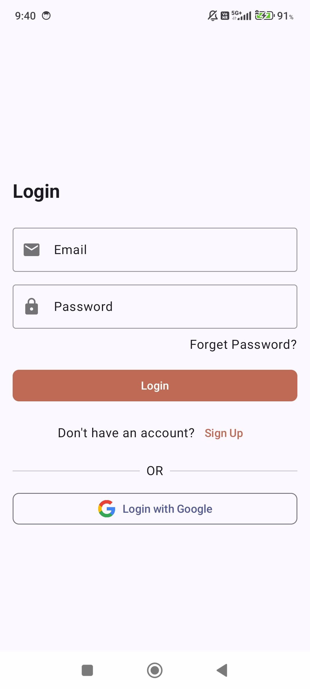
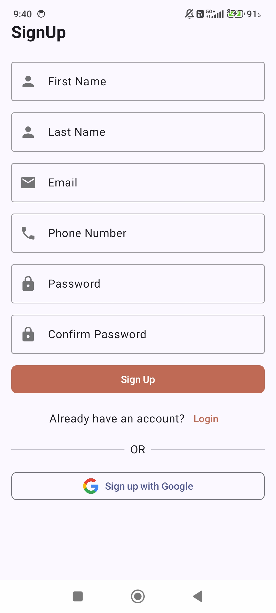
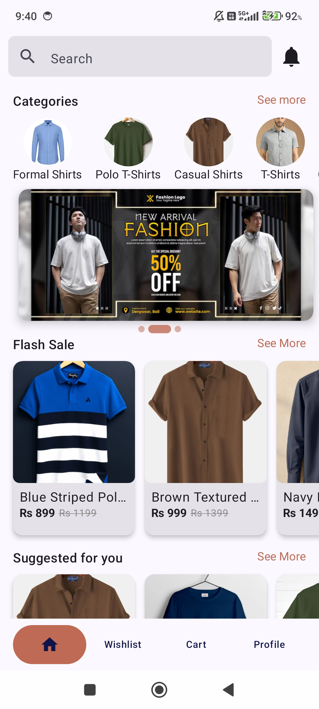
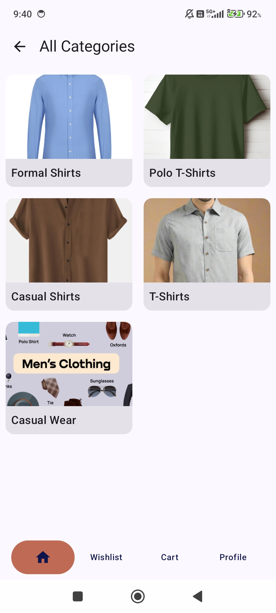
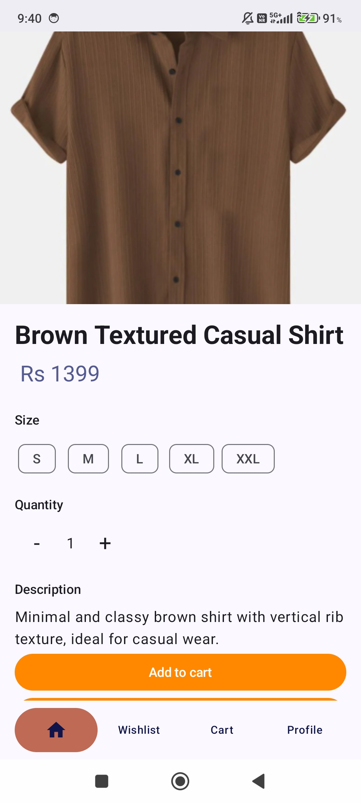
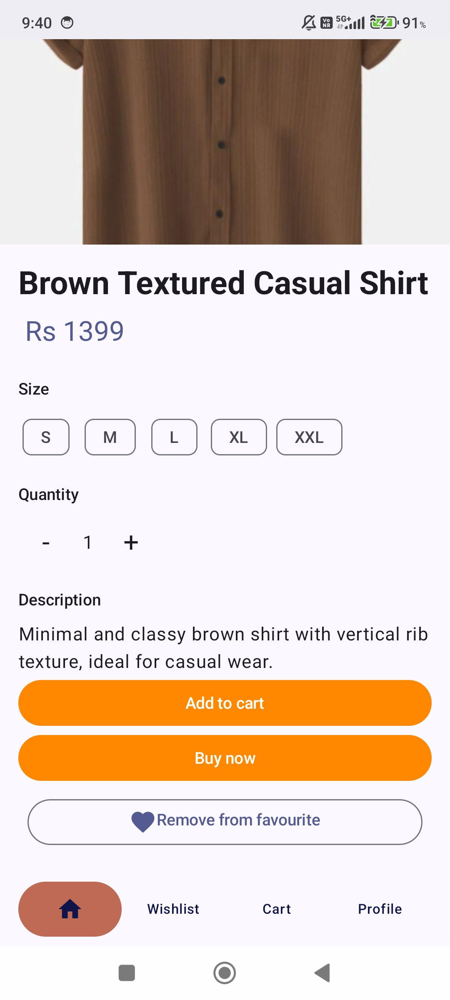
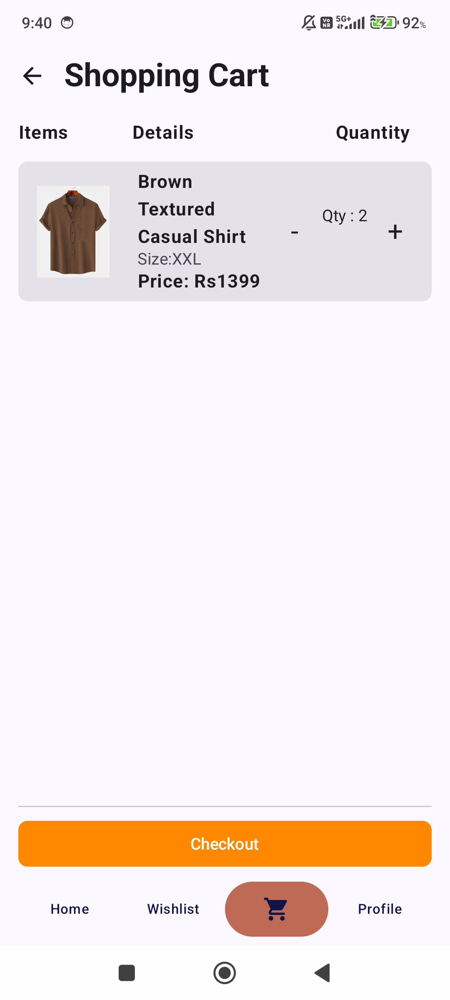
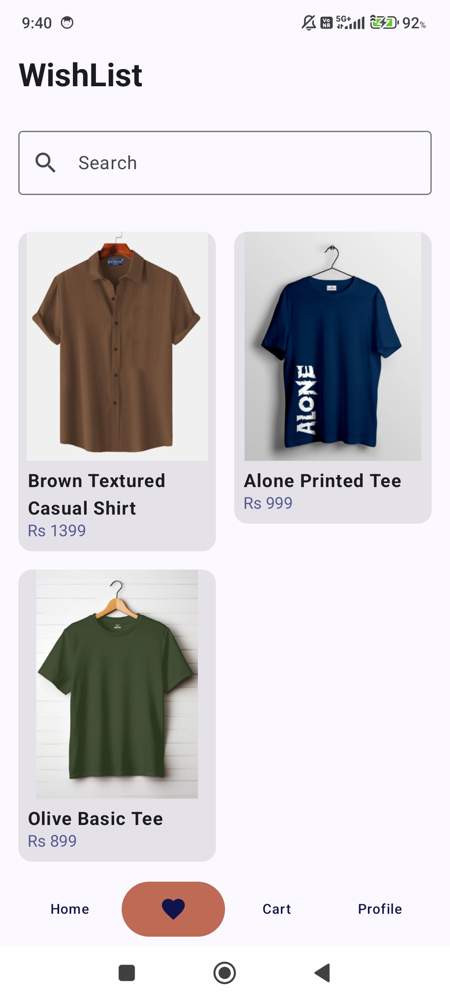
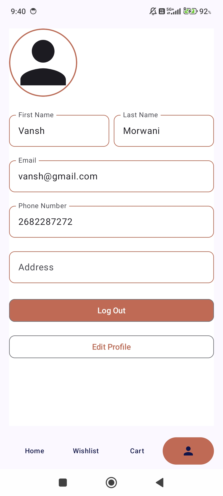

# 🛍️ ShoppingApp – Modern E-Commerce Android App

A fully functional **E-Commerce Android application** built using **Kotlin** and **Jetpack Compose**, following **MVVM Architecture** and powered by **Firebase Authentication & Firestore Database**.

This project demonstrates modern Android development practices including clean architecture, state management, real-time database integration, and responsive UI design.

---

## Screenshots

## 📱 App Features

### 🔐 Authentication
- Email & Password Login
- Google Sign-In
- Secure Firebase Authentication
- Persistent Login Session

### 🏠 Home Screen
- Categories Section
- Flash Sale Section
- Suggested Products
- Product Search
- Banner Carousel

### 📂 Categories
- View all product categories
- Category-based filtering

### 🛍️ Product Details
- Product Image Preview
- Size Selection (S, M, L, XL, XXL)
- Quantity Selector
- Add to Cart
- Buy Now
- Add/Remove from Wishlist
- Product Description

### 🛒 Cart
- Add items to cart
- Increase/Decrease quantity
- Dynamic price display
- Checkout button

### ❤️ Wishlist
- Add to wishlist
- Remove from wishlist
- Persistent Firestore storage

### 👤 Profile
- View user details
- Edit profile
- Logout functionality

---

## 🛠️ Tech Stack

- **Language:** Kotlin  
- **UI:** Jetpack Compose  
- **Architecture:** MVVM  
- **Backend:** Firebase  
  - Firebase Authentication  
  - Google Sign-In  
  - Firebase Firestore  
- **Navigation:** Jetpack Navigation Compose  
- **State Management:** StateFlow / LiveData  

---

## 🧱 Architecture – MVVM

The app follows clean MVVM architecture:

UI (Compose Screens)
↓  
ViewModel  
↓  
Repository  
↓  
Firebase (Auth + Firestore)

### Why MVVM?
- Clear separation of concerns  
- Lifecycle-aware components  
- Scalable & maintainable code  
- Easier testing  

---
